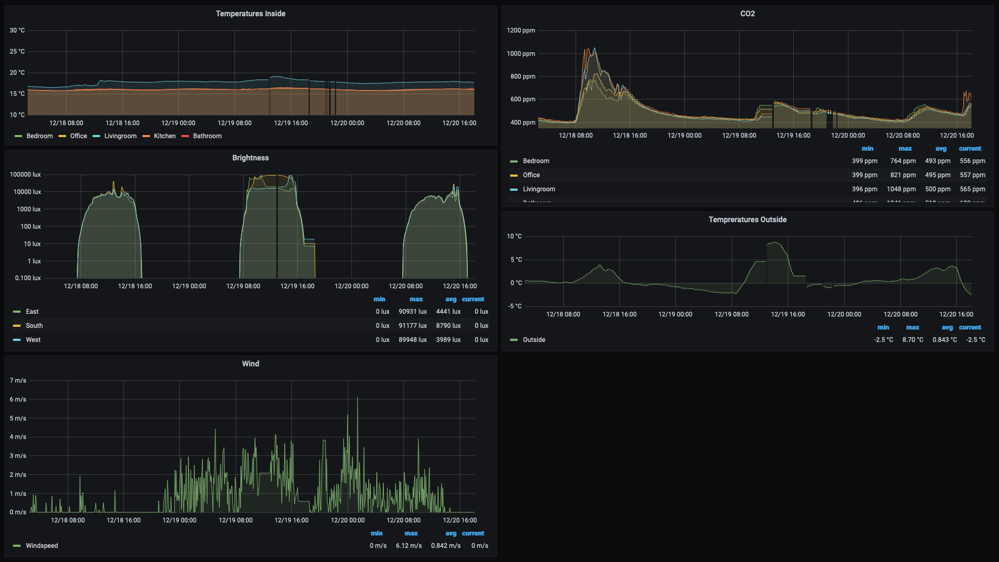

# KNX Prometheus Exporter

[](https://app.fossa.com/projects/git%2Bgithub.com%2Fchr-fritz%2Fknx-exporter?ref=badge_small)
[](https://github.com/chr-fritz/knx-exporter/actions?query=workflow%3A%22Go+build%22)
[](https://sonarcloud.io/dashboard?id=chr-fritz_knx-exporter)
[](https://sonarcloud.io/dashboard?id=chr-fritz_knx-exporter)
[](https://pkg.go.dev/github.com/chr-fritz/knx-exporter)

The KNX Prometheus Exporter is a small bridge to export values measured by KNX sensors to
Prometheus. It takes the values either from cyclic sent `GroupValueWrite` telegrams and can request
values itself using `GroupValueRead` telegrams.

The data stored in Prometheus can be visualized with [Grafana](https://grafana.com/). This could
look like this screenshot:


<!-- TOC -->

* [KNX Prometheus Exporter](#knx-prometheus-exporter)
    * [Installing](#installing)
        * [macOS](#macos)
        * [Docker](#docker)
        * [Other](#other)
    * [Usage](#usage)
        * [Converting the ETS 5 Group Export to a configuration](#converting-the-ets-5-group-export-to-a-configuration)
        * [Preparing the configuration](#preparing-the-configuration)
            * [The `Connection` section](#the-connection-section)
                * [The `RouterConfig`](#the-routerconfig)
                * [The `TunnelConfig`](#the-tunnelconfig)
            * [The `MetricsPrefix`](#the-metricsprefix)
            * [The `ReadStartupInterval`](#the-readstartupinterval)
            * [The `AddressConfigs` section](#the-addressconfigs-section)
        * [Running the exporter](#running-the-exporter)
        * [Running the exporter using docker](#running-the-exporter-using-docker)
    * [Exported metrics](#exported-metrics)
    * [Health Check Endpoints](#health-check-endpoints)
    * [Contributing](#contributing)
        * [Renamed branch to `main`](#renamed-branch-to-main)
    * [License](#license)
    * [Maintainer](#maintainer)

<!-- TOC -->

## Installing

### macOS

Using brew tap:

```shell script
brew tap chr-fritz/tap
brew install chr-fritz/tap/knx-exporter
```

### Docker

```shell script
docker pull quay.io/chrfritz/knx-exporter
```

### Other

Download the [latest release](https://github.com/chr-fritz/knx-exporter/releases/latest) and place
it in your `$PATH`.

## Usage

### Converting the ETS 5 Group Export to a configuration

The KNX Prometheus Exporter will only export the values from configured group addresses. A good
starting point is to
[export the group addresses](https://support.knx.org/hc/en-us/articles/115001825324-Group-Address-Export)
from ETS 5 into the XML format and convert them.

Please refer to the KNX Documentation
"[Group Address & Export](https://support.knx.org/hc/en-us/articles/115001825324-Group-Address-Export)"
for more information about how to export the group addresses to XML.

With the exported group addresses you can call the `knx-exporter` and convert them:

```shell script
knx-exporter convertGA [SOURCE] [TARGET]
```

You must replace `[SOURCE]` with the path to your group address export file. `[TARGET]` is the path
where the converted configuration should be stored.

### Preparing the configuration

Converting the group addresses is a good starting point for preparing the actual configuration. The
simplest fully configuration will look like this:

```yaml
Connection:
    Type: "Tunnel"
    Endpoint: "192.168.1.15:3671"
    PhysicalAddress: 2.0.1
MetricsPrefix: knx_
ReadStartupInterval: 200ms
AddressConfigs:
    0/0/1:
        Name: dummy_metric
        DPT: 1.*
        Export: true
        MetricType: "counter"
        ReadStartup: true
        ReadActive: true
        MaxAge: 10m
        Comment: dummy comment
        Labels:
            room: office
```

In the next sections we will describe the meanings for every statement.

#### The `Connection` section

The `Connection` section contains all settings about how to connect to your KNX system and how the
KNX Prometheus Exporter will identify itself within it. It has three properties:

- `Type` This defines the connection type to your KNX system. It can be either `Router` or `Tunnel`.
- `Endpoint` This defines the ip address or hostname including the port to where the KNX Prometheus
  Exporter should open the connection. In case of you are using `Router` in `Type` the default might
  be `224.0.23.12:3671`.
- `PhysicalAddress` This defines the physical address of how the KNX Prometheus Exporter will identify
  itself within your KNX address.
- `RouterConfig` This defines additional
- `TunnelConfig` contains some specific configurations if Type is Tunnel

##### The `RouterConfig`

- `RetainCount` specifies how many sent messages to retain. This is important for when a router
  indicates that it has lost some messages. If you do not expect to saturate the router, keep this
  low.
- `Interface` specifies the name of the network interface used to send and receive KNXnet/IP
  packets. If the interface is nil, the system-assigned multicast interface is used.
- `MulticastLoopbackEnabled` specifies if Multicast Loopback should be enabled.
- `PostSendPauseDuration` specifies the pause duration after sending. `0` means disabled. According
  to the specification, we may choose to always pause for 20 ms after transmitting, but we should
  always pause for at least 5 ms on a multicast address.

##### The `TunnelConfig`

- `ResendInterval` is the interval with which requests will be resent if no response is received.
- `HeartbeatInterval` specifies the time interval which triggers a heartbeat check.
- `ResponseTimeout` specifies how long to wait for a response.
- `SendLocalAddress` specifies if local address should be sent on connection request.
- `UseTCP` configures whether to connect to the gateway using TCP.

#### The `MetricsPrefix`

The `MetricsPrefix` defines a single string that will be added to all your exported metrics. The
format must be compliant with the
[prometheus metrics names](https://prometheus.io/docs/practices/naming/#metric-names).

#### The `ReadStartupInterval`

It is possible to send `GroupValueRead` telegrams to specific group addresses at startup.
Sending out all `GroupValueRead` telegrams at once on startup can overwhelm the KNX bus.
The `ReadStartupInterval` defines the interval between the `GroupValueRead` telegrams sent out at
startup. If not specified, `ReadStartupInterval` is set to 200ms by default.

#### The `AddressConfigs` section

The `AddressConfigs` section defines all the information about the group addresses which should be
exported to Prometheus. It contains the following structure for every exported group address.

```yaml
  0/0/1:
      Name: dummy_metric
      DPT: 1.*
      Export: true
      MetricType: "counter"
      ReadStartup: true
      ReadActive: true
      MaxAge: 10m
      Comment: dummy comment
      Labels:
          room: office
```

The first line `0/0/1` defines the group address that should be exported. It can be written in all
three valid forms:

- Two layers: `0/1`
- Three layers: `0/0/1`
- Free structure `123`

You can find more information about the formatting of group addresses here:
[cemi@v0.0 NewGroupAddrString](https://pkg.go.dev/github.com/vapourismo/knx-go/knx/cemi@v0.0.0-20230307194121-5fc424ba6886#NewGroupAddrString)

Next it defines the actual information for a single group address:

- `Name` is the short name of the exported metric. The format must be compliant with the
  [prometheus metrics names](https://prometheus.io/docs/practices/naming/#metric-names).
- `DPT` The knx data point type. This defines how the KNX Prometheus Exporter will interpret the
  payload of received telegrams. All available data point types can be found here:
  [knx dpt](https://pkg.go.dev/github.com/vapourismo/knx-go@v0.0.0-20230307194121-5fc424ba6886/knx/dpt)
- `Export` Can be either `true` or `false`. Allows to disable exporting the group address as value.
- `MetricType` defines the type of the exported metric. Can be either `counter` or `gauge`. See
  [Prometheus documentation counter vs. gauge](https://prometheus.io/docs/practices/instrumentation/#counter-vs-gauge-summary-vs-histogram)
  for more information about it.
- `ReadStartup` can either be `true` or `false`. If set to `true` the KNX Prometheus Exporter will
  send a `GroupValueRead` telegram to the group address to actively ask for a new value once after
  startup. In contrast to `ReadActive` this sends out a `GroupValueRead` telegram at startup once.
- `ReadActive` can either be `true` or `false`. If set to `true` the KNX Prometheus Exporter will
  send a `GroupValueRead` telegram to the group address to active ask for a new value if the last
  received value is older than `MaxAge`.
- `MaxAge` defines the maximum age of a value until the KNX Prometheus Exporter will send a
  `GroupValueRead` telegram to active request a new value for the group address. This setting will
  be ignored if `ReadActive` is set to `false`.
- `Comment` a short comment for the group address. Will be also exported as comment within the
  Prometheus metrics.
- `Labels` are additional information for a specific time series. A common usage of labels could be
  a label `room` which identifies the room for a metric `current_temperature`.

### Running the exporter

To run the metrics export just run the following command:

```shell script
knx-exporter run -f [CONFIG-FIlE]
```

You must replace `[CONFIG-FILE]` with the path to your configuration file that you prepared in the
previous step. After starting the exporter you can open
[`http://localhost:8080/metrics`](http://localhost:8080/metrics) to view the exported metrics.

### Running the exporter using docker

It is also possible to run the KNX Exporter using docker. For this just run the following command:

```shell script
docker run -p 8080:8080 -v [CONFIG-FILE]:/etc/knx-exporter/ga-config.yaml quay.io/chrfritz/knx-exporter
```

As before you must replace `[CONFIG-FILE]` with the path to your configuration file that you
prepared in the previous step then you can open
[`http://localhost:8080/metrics`](http://localhost:8080/metrics) to view the exported metrics.

## Exported metrics

Beside exported metrics from KNX group addresses it exports some additional metrics. This metrics
can be grouped into three groups:

1. **KNX Message Metrics:** Three counter metrics which counts the number of
    - received messages `knx_messages{direction="received",processed="false"}`
    - processed received messages `knx_messages{direction="received",processed="true"}` and
    - sent messages `knx_messages{direction="sent",processed="true"}`.
2. **HTTP Metrics:** Counts the processed number of successfully and failed http requests. All
   metrics starts with `promhttp_`.
3. **GoLang Metrics:** These are metrics that indicate some health information about memory, cpu
   usage, threads and other GoLang internal information.

## Health Check Endpoints

The KNX Prometheus Exporter provides endpoints for liveness and readiness checks like they were
recommended in environments like Kubernetes. They are reachable under `/live` and `/ready`. With
`/live?full=1` and `/ready?full=1` they also print the status of every single check.

## Contributing

1. Fork it
2. Download your fork to your
   PC (`git clone https://github.com/your_username/knx-exporter && cd knx-exporter`)
3. Create your feature branch (`git checkout -b my-new-feature`)
4. Make changes and add them (`git add .`)
5. Commit your changes (`git commit -m 'Add some feature'`)
6. Push to the branch (`git push origin my-new-feature`)
7. Create new pull request

### Renamed branch to `main`

The name of default branch recently changed from `master` to `main`. If you have a local working
copy of this repository you can rename it using the following commands:

```shell
git branch -m master main
git fetch origin
git branch -u origin/main main
git remote set-head origin -a
```

## License

The KNX Exporter is released under the Apache 2.0 license. See
[LICENSE](https://github.com/chr-fritz/knx-exporter/blob/main/LICENSE)

## Maintainer

Christian Fritz (@chrfritz)
